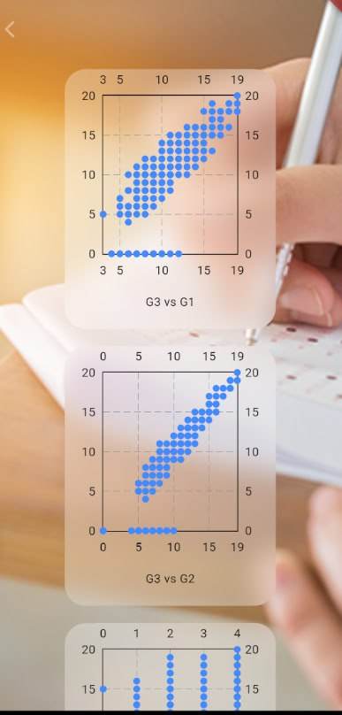

# Grade-predict 

**Android Emulator Running The Flutter App frontend. The Flutter application presents a form. The form will be filled, converted into data that the model can understand, and sent to the API.**
---

**The flutter app showing the predicted value as obtained from the API. the api response can be seen on the left on the terminal logs**
---

**The app also visualizes the dataset that the model is trained on, it shows scatter plots of the target variable against other variables**
